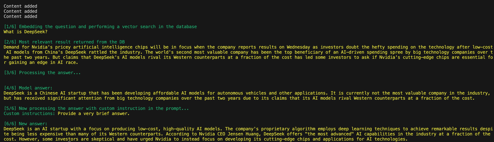

# rag

RAG (Retrieval-Augmented Generation) in action.

## About this project

This sample intends to show some basic AI concepts related to RAG.

## Features

- [X] Load an run LLM models locally using [Ollama](https://ollama.com/)
- [X] Transform texts into vectors (array of numbers) in a process called Embedding
- [X] Store vectors in a database with vector support like PosgreSQL/pgvector
- [X] Query vectors by similarity ([pgvector](https://github.com/pgvector/pgvector))
- [X] Ask a question related to these texts and use an AI model to describe the best result using different words

## Local configuration

### Adding LLM models

- available list of models for download: **link**
- pick a model for embedding and chat and add them to the list in the ```docker-compose.yaml``` file to download them when docker compose starts.
- add the model names to the ```ollama-provider.ts``` file, being one model for Embeddings and another model (or the same) for the chat. Note that not all models support embeddings.
- update the table column size according to the selected model for embedding in the ```schema.sql``` file. (need to delete the Docker container and volume)


### Running the sample

- install and run Docker
- run ```npm install```
- run ```docker compose up```
- run ```npm run start```

Note: the fields ```type``` and ```description``` can be disconsidered as they were used for testing purposes.
Note: Downloading all selected models might take a few minutes (pulling manifest).


The instructions are not followed as desired in these smaller models.

### Files

- ```vector.ts``` - equivalent to a repository, talks to the database to store table records with vectors and perform vector search.
- ```ollama-provider.ts``` - a class that abstracts HTTP calls to the Ollama server, where the models are hosted.
- ```embedding-model``` - a class that abstracts and orchestrates calls to ollama and the database.
- ```main.ts``` - entry point of the application.


## Learning notes

- LLM models vary in number of parameters from millions to hundreds of billions. The bigger the # of parameters, the more processing power it will require to perform calculations, but the results tend to be more accurate.
- vectors generated by different LLM models will result in arrays with different sizes. This affects the column definition in the database.

    | LLM model        | Data type    |
    | ---------------- | ------------ |
    | nomic-embed-text | vector(768)  |
    | llama3.2:3b      | vector(3072) |
    | all-minilm:33m   | vector(384)  |
    | tinyllama        | vector(2048) |
    | mistral:7b       | vector(4096) |
    | etc              | etc          |

- for vector search for Embeddings, it's recommended using cosine similarity
- large texts should be split into smaller pieces of text for embedding. This relates to the # of inputs (tokens) supported by each LLM model.
